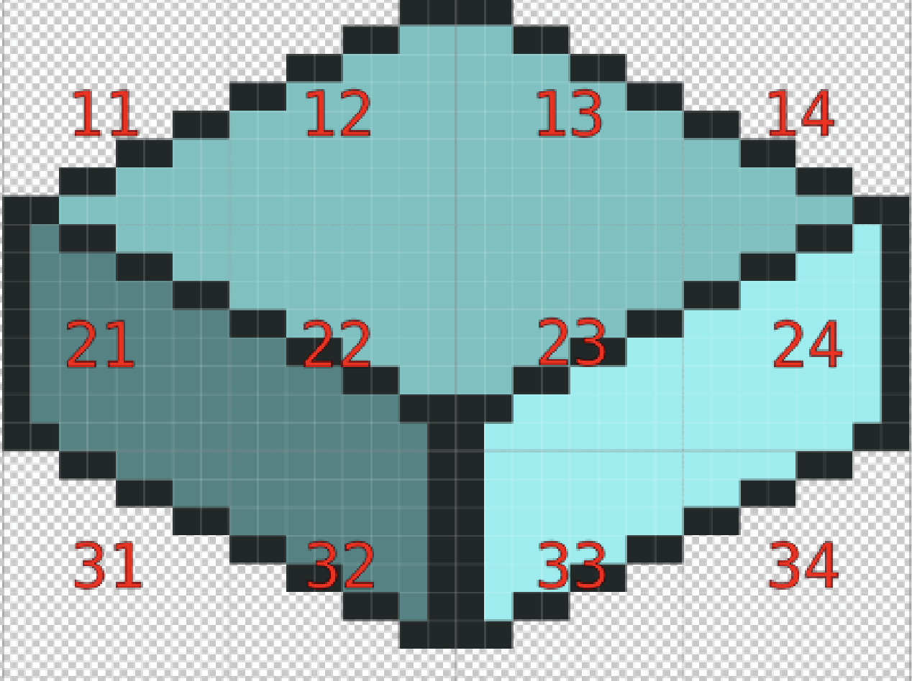

# Isometric Map Editor

This project uses the PixiJS starter template. It provides an isometric map editor for building worlds similar to those found in games like Final Fantasy Tactics Advance (FFTA).


- `npm run dev` to start
- `npm run deploy` to push to GH pages (https://harmonictons.github.io/isometric-map-editor/)

Most of the code can be found in `/src/app/screens/main`, split into `iso/` (projection and depth keys), `map/` (terrain), `character/`, `input/` and `debug/`.

# How it works

## Tile fragments

Each tile (32×24 px) is split into 12 8×8 px fragments , in a 3x 4 grid. A fragment is identified by `[LINE][COLUMN]`: `11` is the top left fragment, `34` the bottom right one.



A tileset represents every possible appearance of each fragment, depending on the neighborhood of the tile:


The tileset JSON is a spritesheet atlas: the neighborhood conditions are encoded in the **frame names**, following this convention:

```
[TILE_TYPE]-[FRAGMENT]-[NEIGHBORS](-[HEIGHT])?.png
```

## Neighbors

A tile has 6 direct neighbors, one per direction, written `u`, `n`, `e`, `s`, `w`, `d` (up, north, east, south, west, down). Directions can be **composed** by concatenating letters, offsets add up: `wu` is the cell one step west and one step up, `uu` two steps up.

`[NEIGHBORS]` is a comma-separated list of `direction:rule` conditions. The texture is only used if **all** its conditions match. The rules are:

| Rule | Meaning |
| --- | --- |
| `0` | no neighbor |
| `1` | a neighbor, whatever its type |
| `*` | anything (neighbor or not) — only used to weigh the score down |
| `=` | a neighbor of the same base type |
| `!` | **not** a neighbor of the same base type: a different base type, *or no neighbor at all* |
| a tile type (ex: `dirt`) | a neighbor of this exact type — `dirt` does **not** match `dirt_grass1` |

**Base types**: a tile type can have a variant, separated by an underscore (`dirt_grass1`, `dirt_pile` are variants of the base type `dirt`). The `=` and `!` rules compare *base* types: `dirt_grass1` and `dirt_pile` are considered the same. The exact-type rule does not.

## Height

The optional `[HEIGHT]` segment is `MOD:VAL`: the texture only applies to tiles whose height `u` satisfies `u % MOD === VAL - 1`. This is how the wall pattern alternates between levels: `wall-22-s:!-2:1.png` and `wall-22-s:!-2:2.png` are used on even and odd levels.

## Scoring

Several textures can match a fragment at the same time. Each one gets a score from its rules :
- `*` = 0, 
- `1` = 1, 
- `!` = 2, 
- everything else (`0`, `=`, exact type) = 5 

The highest total score wins: the most specific texture takes precedence over generic fallbacks.

For a variant type (`dirt_grass1`), the textures of its base type (`dirt`) are also candidates, with a −1 penalty on their score.

If no texture matches, the fragment is empty. This is not an error: the faces hidden by neighboring tiles have no matching texture, ands fully surrounded tiles are invisible.

## Examples

- `dirt-11-w:0,u:!,s:0.png`: "the top left fragment of a `dirt` tile, when there is no neighbor west, no same-base-type neighbor up (a different type or nothing), and no neighbor south" — a top face corner.
- `dirt-11-w:1,wu:1,u:!.png`: uses a composed direction — "there is a neighbor west, a neighbor above the west one (`wu`), and no same-type neighbor up" — the top face blends into a slope rising west.
- `wall-21-s:0,w:0-2:2.png`: "the middle left fragment of a `wall` tile with no neighbor south nor west, on odd levels (`u % 2 === 1`)."